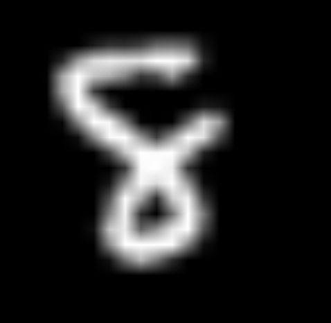
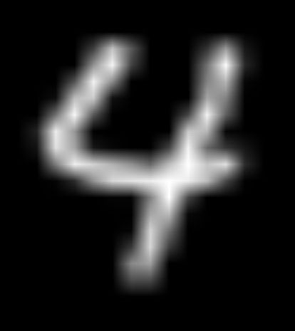
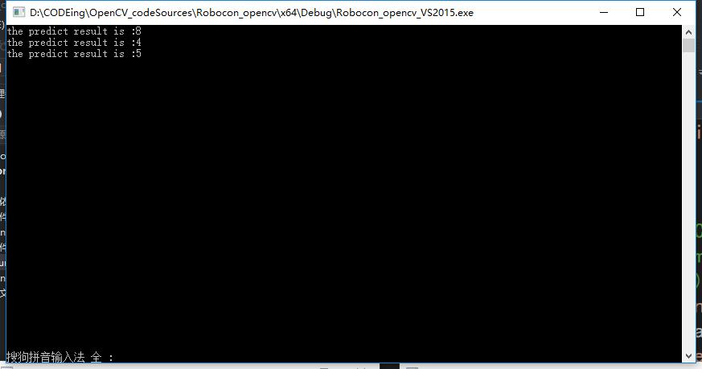

 # 这是一个用KNN分类手写数字图像的小工程
 ## 程序组织框架：
      bin：用于存放编译生成的二进制文件
      src：存放源文件
      include：存放头文件
      data：存放训练数据和测试数据
      lib：存放生成的库文件
      saveKNN：存放训练好的模型
 ## 实验内容：
      从opencv/sample/data文件夹提供的digits.png文件中提取训练和验证数据，
      然后保存训练好的模型，接着读入测试用的图片（放在data/cv_sample_png/目录下）
      用训练好的模型对处理过的图像进行分类并控制台输出分类结果。
 ###  训练数据集 -------------------------------------------------------------------------------------------
 

 ### 测试数据  -------------------------------------------------------------------------------------------—

 ### 测试结果 -------------------------------------------------------------------------------------------
 

